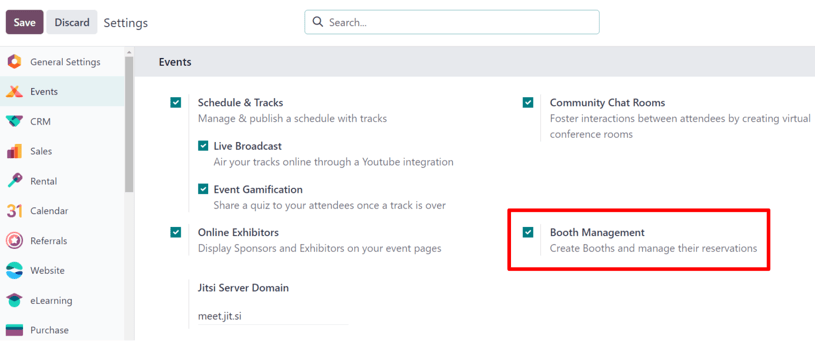
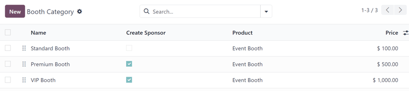
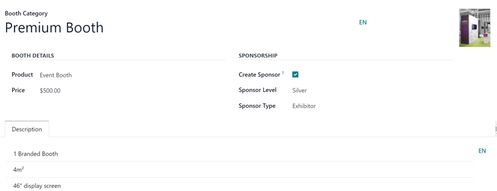

============
Event booths
============

The Odoo *Events* application provides users with the ability to create event booths, sell their
availability, and manage their reservations.

Configuration
=============

In order to create, sell, and manage booths for events, the *Booth Management* feature must be
activated.

To do that, navigate to :menuselection:`Events app --> Configuration --> Settings`, and tick the
checkbox beside :guilabel:`Booth Management`. Then, click :guilabel:`Save`.

.. important::
   When the :guilabel:`Booth Management` setting is activated, a new *Product Type* becomes
   available on all product forms: *Event Booth*.

   This is important because every created booth **must** be assigned a *Booth Category* on their
   respective booth form, and every booth category **must** have an *Event Booth* product assigned
   to it.

Booth categories
================

With the *Booth Management* setting activated in the *Events* app, a *Booth Categories* option
becomes available in the :guilabel:`Configuration` menu.

To access the :guilabel:`Booth Category` dashboard, go to :menuselection:`Events app -->
Configuration --> Booth Categories`. Doing so reveals a list of all the booth categories that have
been created in the database.

On the :guilabel:`Booth Category` page, the following information for each booth category is listed:

- :guilabel:`Name`: the name of the booth category.
- :guilabel:`Create Sponsor`: if the box in this column is ticked, that means when a booth with this
  category is booked, a sponsor is created for the user who booked it. 
- :guilabel:`Product`: the *Event Booth* product associated with that specific booth category.
- :guilabel:`Price`: the price of a booth in that booth category.

When the :guilabel:`additional options` :icon:`oi-settings-adjust` icon, located to the far-right of
the column titles, is clicked, a drop-down menu of additional column options appears. From the
resulting drop-down menu, tick the box beside :guilabel:`Sponsor Level` and/or :guilabel:`Sponsor
Type` to reveal those columns on the :guilabel:`Booth Category` page.

To edit an existing booth category, select it from the list, and proceed to make any desired
modifications from the event category form.

Create booth category
---------------------

To create a booth category from the :guilabel:`Booth Category` page, click the :guilabel:`New`
button in the upper-left corner to reveal a blank booth category form.

go through the entire booth category form....field by field...

Add booth to an event
=====================

Get into the 'Booths' page, via the smart button...

speak on that page, the 'Available' and 'Unavailable' columns...and how to modify any of the existing
booths by selecting them, and making any changes on their booth form.

To create a new one, just click 'New'...

[image of a filled out booth form]

go through the entire booth form, field by field

Sell event booths
=================

The event form for the event should have their corresponding event template form equipped with the 'Booth Menu Item'
on the event template form -- if they're using a template...

Then, navigate to the front-end to view the event website, select the 'get a booth' subheader menu
option, where all the configured booths (and booth pics and info) can be seen by the visitor.

[screenshot of 'get a booth' page]

The visitor selects their desired Booth option, and location, then clicks 'Book my Booth(s)' button.

They then fill out the Contact (or Sponsor) Details page, depending on the booth's configuration, and 
click 'Go to Payment'

On the 'Review Order' page, they review their selection, and proceed with the checkout process.

Upon a successful payment confirmation, that selected booth automatically moves to the 'Unavailable'
stage on the event-specific booths page (accesible via the 'booths' smart button). And, when that
booth is selected from that page, all the Renter fields are populated with the information provided by
the visitor who purchased the booth on the event website.

Their sponsor (if applicable) and Sales Order information are also accessible via smart buttons
on the booth form.

And that Sponsor information can be modified, if needed, from that connected page.